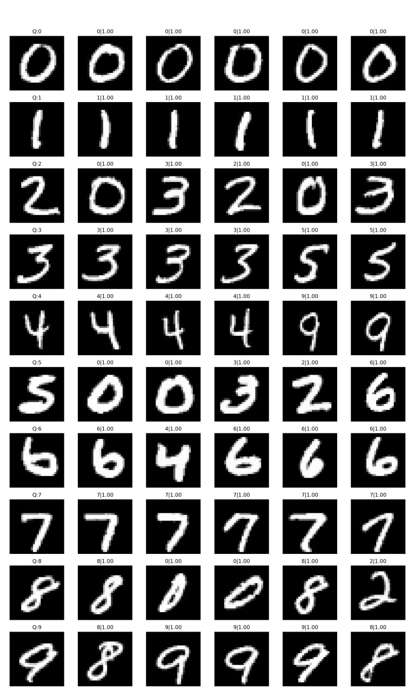
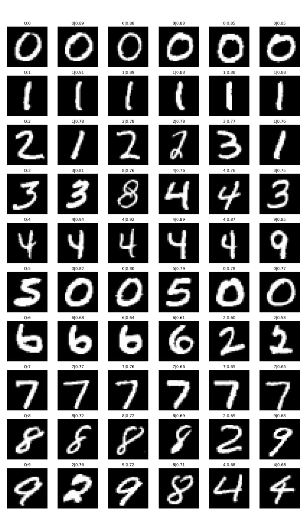
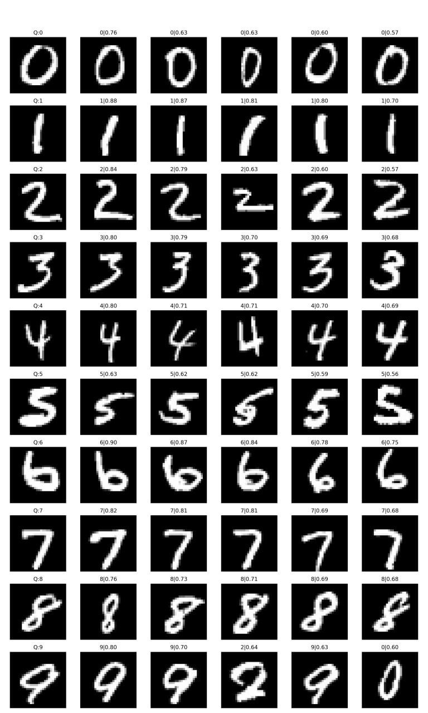
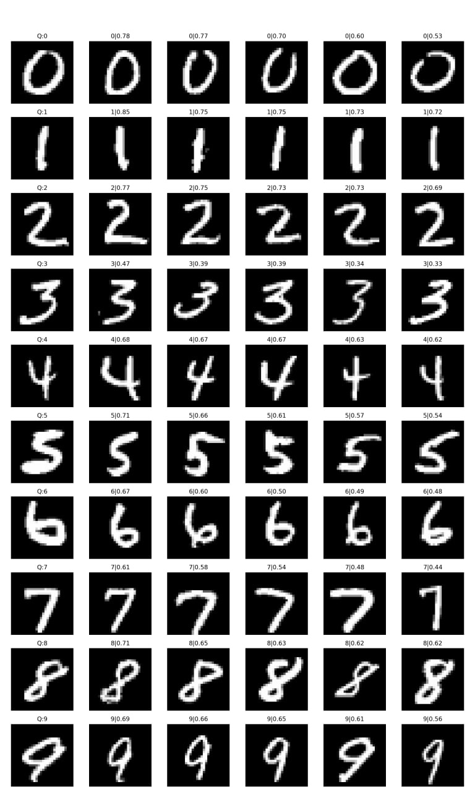

# HardLeJEPA: Adversarial Sliced Regularization with Learnable Directions

PyTorch implementation + MNIST experiments for **HardLeJEPA**: learning *adversarial* SIGReg directions with **QR orthogonalization**, plus λ-scheduling for stable training.

## TL;DR
- **I-JEPA** baseline (teacher–student, predictive targets)
- **LeJEPA** (mean-pulling objective + SIGReg regularization)
- **HardLeJEPA**: learn directions that *maximize* SIGReg signal (adversarial mining) and apply **QR decomposition** to avoid collinearity

---
<table>
  <tr>
    <td align="center"><b>I-JEPA</b></td>
    <td align="center"><b>I-JEPA + SIGReg</b></td>
    <td align="center"><b>LeJEPA</b></td>
    <td align="center"><b>HardLeJEPA</b></td>
  </tr>
  <tr>
    <td></td>
    <td></td>
    <td></td>
    <td></td>
  </tr>
</table>

## Repository structure
```
.
├── config.py
├── data/
│   └── mnist.py
├── losses/
│   ├── sigreg.py
│   ├── sigreg_hard.py
│   └── ...
├── models/
│   ├── encoder.py
│   ├── predictor.py
│   └── ...
├── train_*.py
├── evaluate.py
├── utils/
│   ├── logger.py
│   ├── plots.py
│   └── ...
└── images/                
```

---

## Setup

### 1) Create environment
```bash
python -m venv .venv
# Windows
.venv\Scripts\activate
# Linux/Mac
source .venv/bin/activate
```

### 2) Install dependencies
```bash
pip install -r requirements.txt
```
---

## Training

### I-JEPA baseline
```bash
python train_ijepa.py --device cuda --epochs 20 --seed 42
```

### I-JEPA + SIGReg
```bash
python train_ijepa.py --method lejepa --lambda_sigreg 0.005 --device cuda --epochs 20
```

### LeJEPA
```bash
python train_pure_sigreg.py --lambda_sigreg 0.005 --num_views 8 --device cuda --epochs 20
```

### HardLeJEPA (learnable mined directions + QR)
```bash
python train_pure_sigreg_HardQR.py --lambda_sigreg 0.001 --hard 128 --pool 512 --device cuda --epochs 20
```

Outputs:
- checkpoints: `checkpoints/*.pt`
- logs: `runs/**/metrics.csv` + TensorBoard events
- figures: `runs/**/report/*.png`

---

## Monitoring
### TensorBoard
```bash
tensorboard --logdir runs
```

### Key metrics to compare
- `eval/knn_acc` (or `eval_student/knn_acc` depending on script)
- `eval/silhouette`
- training: `train/loss_total`, `train/loss_pull`, `train/loss_sigreg`
- representation: collapse/spectrum metrics from `metrics/repr_stats.py`

---
